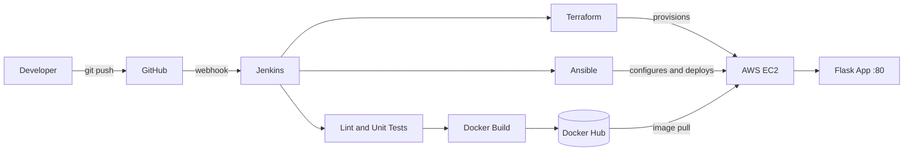

# CI/CD Pipeline for a Dockerized Python App


An end-to-end CI/CD pipeline that tests, containerizes, and deploys a Python (Flask) application to AWS EC2. Infrastructure is provisioned with Terraform, the host is configured and the application deployed with Ansible, and the whole workflow is orchestrated by Jenkins on every push to GitHub.

## Table of Contents

- [Architecture](#architecture)
- [Tech Stack](#tech-stack)
- [Project Structure](#project-structure)
- [Application Endpoints](#application-endpoints)
- [Prerequisites](#prerequisites)
- [Run Locally](#run-locally)
- [Jenkins Setup](#jenkins-setup)
- [Pipeline Stages](#pipeline-stages)
- [Manual Infrastructure and Deployment](#manual-infrastructure-and-deployment)
- [Cleanup](#cleanup)
- [Security Notes](#security-notes)
- [License](#license)

## Architecture



## Tech Stack

| Layer                | Tool                       |
|----------------------|----------------------------|
| Application          | Python 3.12, Flask, Gunicorn |
| Testing / Linting    | Pytest, Flake8             |
| Containerization     | Docker                     |
| CI/CD Orchestration  | Jenkins, GitHub            |
| Infrastructure       | Terraform, AWS EC2         |
| Configuration / Deploy | Ansible                  |

## Project Structure

```
.
├── app/                    # Flask application
│   └── main.py
├── tests/                  # Pytest unit tests
├── terraform/              # EC2, key pair, security group
├── ansible/                # Playbook and roles (docker, app)
│   ├── playbook.yml
│   └── roles/
├── Dockerfile
├── Jenkinsfile             # Declarative pipeline
├── requirements.txt
├── requirements-dev.txt
└── README.md
```

## Application Endpoints

| Method | Path      | Description                       |
|--------|-----------|-----------------------------------|
| GET    | `/`       | Welcome message, version, environment |
| GET    | `/health` | Health check used by Docker and the pipeline |
| GET    | `/info`   | Hostname, Python version, timestamp |

## Prerequisites

- Python 3.12+
- Docker
- Terraform >= 1.5
- Ansible >= 2.14
- AWS account with programmatic access
- Docker Hub account
- Jenkins server with Docker, Terraform, Ansible, Python 3 (`python3-venv`), and `curl` installed

## Run Locally

```bash
git clone https://github.com/Tamil27092005/<repo-name>.git
cd <repo-name>

python3 -m venv venv
source venv/bin/activate
pip install -r requirements-dev.txt

flake8 app tests
pytest
python -m app.main
```

Run with Docker:

```bash
docker build -t cicd-python-app .
docker run -d -p 5000:5000 --name python-app cicd-python-app
curl http://localhost:5000/health
```

## Jenkins Setup

**1. Plugins:** Pipeline, Git, GitHub, Credentials Binding, SSH Agent, JUnit.

**2. Grant Docker access to Jenkins:**

```bash
sudo usermod -aG docker jenkins && sudo systemctl restart jenkins
```

**3. Add credentials** (Manage Jenkins > Credentials):

| ID                | Type                          | Purpose                          |
|-------------------|-------------------------------|----------------------------------|
| `dockerhub-creds` | Username with password        | Docker Hub username and access token |
| `aws-creds`       | Username with password        | AWS access key ID (username) and secret key (password) |
| `ec2-ssh-key`     | SSH Username with private key | Private key used for EC2 access (username: `ubuntu`) |

**4. Update the image name** in `Jenkinsfile`:

```groovy
IMAGE_REPO = 'your-dockerhub-username/cicd-python-app'
```

**5. Create the job:** New Item > Pipeline > *Pipeline script from SCM* > Git > repository URL > script path `Jenkinsfile`.

**6. Webhook:** GitHub repository > Settings > Webhooks > `http://<jenkins-host>:8080/github-webhook/` (content type `application/json`, push events). Enable *GitHub hook trigger for GITScm polling* in the job.

## Pipeline Stages

| # | Stage                | Description                                           |
|---|----------------------|-------------------------------------------------------|
| 1 | Checkout             | Pull source from GitHub                               |
| 2 | Install and Lint     | Create virtualenv, install dependencies, run Flake8   |
| 3 | Unit Tests           | Run Pytest and publish JUnit results                  |
| 4 | Build Docker Image   | Build image tagged with build number and `latest`     |
| 5 | Push to Docker Hub   | Authenticate and push both tags                       |
| 6 | Terraform Provision  | Optional (`PROVISION_INFRA`): create EC2 and networking |
| 7 | Deploy with Ansible  | Install Docker on EC2, pull image, run container     |
| 8 | Smoke Test           | Verify `/health` on the deployed instance             |

Build parameters:

- `PROVISION_INFRA`: run Terraform apply before deployment (required on the first run).
- `DESTROY_INFRA`: run Terraform destroy and skip all other stages.

> Terraform state is stored in the Jenkins workspace by default. For a shared or production setup, configure the S3 backend in `terraform/versions.tf`.

## Manual Infrastructure and Deployment

**Terraform**

```bash
cd terraform
export AWS_ACCESS_KEY_ID=<key>
export AWS_SECRET_ACCESS_KEY=<secret>

terraform init
terraform plan  -var="public_key=$(cat ~/.ssh/id_rsa.pub)"
terraform apply -var="public_key=$(cat ~/.ssh/id_rsa.pub)"
terraform output public_ip
```

**Ansible**

```bash
cd ansible
ansible-galaxy collection install -r requirements.yml
ansible-playbook playbook.yml \
  -i "<EC2_PUBLIC_IP>," -u ubuntu --private-key ~/.ssh/id_rsa \
  --extra-vars "docker_image=<dockerhub-user>/cicd-python-app docker_tag=latest"
```

Verify:

```bash
curl http://<EC2_PUBLIC_IP>/health
```

## Cleanup

```bash
cd terraform
terraform destroy -var="public_key=$(cat ~/.ssh/id_rsa.pub)"
```

Or run the Jenkins job with `DESTROY_INFRA` enabled.

## Security Notes

- Restrict `ssh_allowed_cidr` to your own IP instead of `0.0.0.0/0`.
- Use Docker Hub access tokens and least-privilege IAM credentials.
- Never commit `.pem` keys, `terraform.tfvars`, or state files (covered by `.gitignore`).
- The container runs as a non-root user.

## License

This project is licensed under the MIT License.
